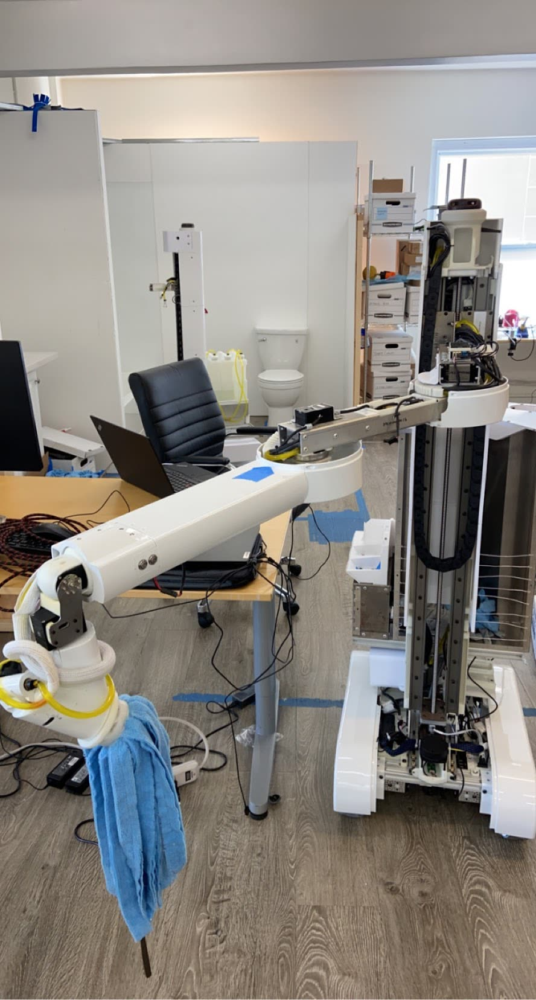

# harshdhruva.github.io

Personal portfolio site for Harsh Dhruva — robotics engineer.

---

## Structure

```
├── index.html                    Home: hero + project grid
├── about.html                    About page
├── projects/                     Individual project detail pages
│   ├── peanut.html
│   ├── autoroboto.html
│   ├── moonranger.html
│   ├── cleaning-policy.html
│   └── tripawd.html
├── assets/
│   ├── css/main.css              All shared styles
│   ├── js/main.js                Nav loader + scroll behavior
│   ├── components/
│   │   ├── header.html           Shared nav (loaded via fetch)
│   │   └── footer.html           Shared footer
│   └── media/                    One folder per project
│       ├── peanut/
│       ├── autoroboto/
│       ├── moonranger/
│       ├── cleaning-policy/
│       └── tripawd/
└── README.md
```

The header and footer are loaded into every page via `fetch()` in `main.js`,
so editing `components/header.html` updates the nav across the entire site.

---

## Deploying to GitHub Pages

1. Create a new GitHub repo named exactly `harshdhruva.github.io`
2. Push this folder's contents to the repo:
   ```bash
   git init
   git add .
   git commit -m "Initial site"
   git branch -M main
   git remote add origin https://github.com/harshdhruva/harshdhruva.github.io.git
   git push -u origin main
   ```
3. In the repo settings → Pages → Source → select `main` branch / root
4. After ~30 seconds, the site goes live at https://harshdhruva.github.io

> ⚠️ **Important:** Because the site uses `fetch()` to load the shared header/footer,
> opening `index.html` directly via `file://` will show broken nav locally.
> Either deploy to GitHub Pages, or run a local server while developing:
> ```bash
> python3 -m http.server 8080
> # then visit http://localhost:8080
> ```

---

## Adding YouTube videos

Each project page has a `.video-embed` block with a placeholder:

```html
<div class="video-embed">
    <iframe
        src="https://www.youtube.com/embed/YOUR_VIDEO_ID"
        ...></iframe>
</div>
```

Replace `YOUR_VIDEO_ID` with the YouTube video ID (the part after `v=` in the URL).

> Tip: set videos to **Unlisted** on YouTube if you want them embeddable but not
> discoverable on YouTube itself.

---

## Adding images / video previews on cards

The home page project cards currently use emoji placeholders inside `.project-thumb`.
Replace them with real media:

**Static image:**
```html
<div class="project-thumb">
    
</div>
```

**Looping video preview (like animated GIFs but better):**
```html
<div class="project-thumb">
    <video autoplay muted loop playsinline>
        <source src="./assets/media/peanut/preview.mp4" type="video/mp4">
    </video>
</div>
```

For preview clips, aim for 5–10 seconds, 720p, H.264, ~2–5 MB per file.
GitHub Pages caps total site size at 1 GB and individual files at 100 MB.

---

## Adding a new project

1. Copy any file in `projects/` (e.g. `peanut.html`) to a new file: `projects/myproject.html`
2. Edit the content, meta block, sections
3. Update the `project-nav` block at the bottom (prev/next links)
4. Add a new card to the grid in `index.html`
5. Optionally add a folder in `assets/media/myproject/` for images and clips

---

## Adding your resume

1. Drop your resume PDF in `/assets/harsh-dhruva-resume.pdf`
2. Uncomment the resume link in `about.html`:
   ```html
   <a href="./assets/harsh-dhruva-resume.pdf" target="_blank" class="btn">Resume (PDF)</a>
   ```

---

## Editing checklist

Things to fill in / replace across the site:

- [ ] **Replace all `YOUR_VIDEO_ID`** placeholders with real YouTube IDs
- [ ] **Replace emoji placeholders** on home page cards with real images or video previews
- [ ] **Update `linkedin.com/in/harshdhruva`** to actual LinkedIn URL (in `components/header.html`, `index.html`, `about.html`)
- [ ] **Update `github.com/harshdhruva`** to actual GitHub URL (same files)
- [ ] **Fill in [TODO] sections** inside each project page with real writeup
- [ ] **Add resume PDF** and enable the link in `about.html`
- [ ] Customize the meta descriptions and og:title in each `<head>` for better link previews

---

## Future ideas

- Custom domain (e.g. `harshdhruva.com`) — buy domain, add CNAME file pointing at `harshdhruva.github.io`, configure DNS
- Add a `/now` page (see https://nownownow.com) for current focus / what you're learning
- Add a `writing/` directory for technical blog posts
- Replace emoji thumbnails with looping preview clips (biggest visual upgrade)
